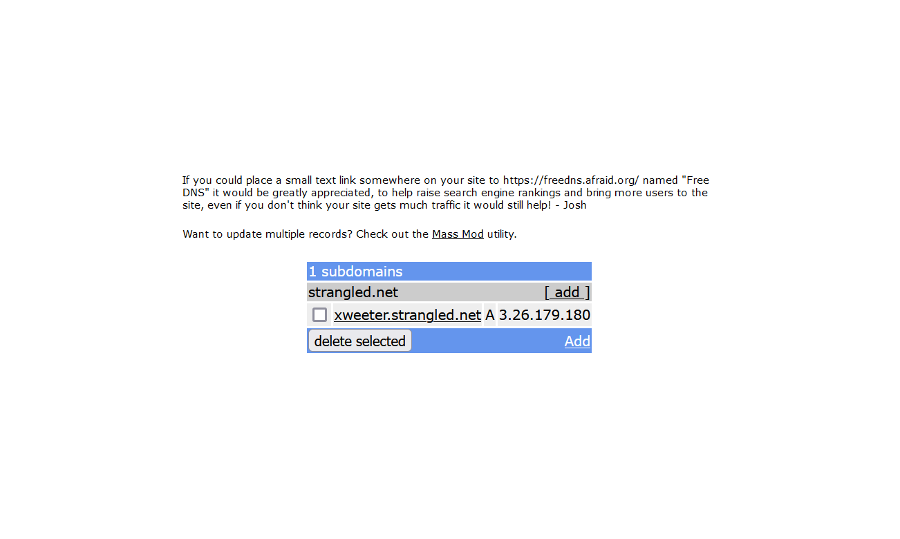

# Xweeter App Deployment

This document outlines the deployment process for a simple social media app built using Vue and Flask.

## Requirements

There are five steps to deploy the app to the server and make it accessible on the web.

1. Preparing the server
2. Dockerizing the app
3. Creating a CI/CD pipeline
4. Configuring the web server using Nginx
5. Creating a domain name

## Steps Explanation

### 1. Preparing the server

In this project, I am using an Ubuntu virtual machine on an EC2 instance from Amazon Web Services. There are several steps involved in preparing the server.

#### Updating the server

```bash
sudo apt update && sudo apt upgrade
```

#### Installing Docker

```bash
# Add Docker's official GPG key:
sudo apt-get update
sudo apt-get install ca-certificates curl gnupg
sudo install -m 0755 -d /etc/apt/keyrings
curl -fsSL https://download.docker.com/linux/ubuntu/gpg | sudo gpg --dearmor -o /etc/apt/keyrings/docker.gpg
sudo chmod a+r /etc/apt/keyrings/docker.gpg

# Add the repository to Apt sources:
echo \
  "deb [arch=$(dpkg --print-architecture) signed-by=/etc/apt/keyrings/docker.gpg] https://download.docker.com/linux/ubuntu \
  $(. /etc/os-release && echo "$VERSION_CODENAME") stable" | \
  sudo tee /etc/apt/sources.list.d/docker.list > /dev/null
sudo apt-get update

# Install the Docker packages:
sudo apt-get install docker-ce docker-ce-cli containerd.io docker-buildx-plugin docker-compose-plugin
```

Source: [Docker documentation](https://docs.docker.com/engine/install/ubuntu/)

#### Installing Nginx

```bash
sudo apt install nginx
```

#### Configuring the Firewall

After installing Nginx, it's essential to configure the firewall to allow traffic on both port 80 (HTTP) and port 443 (HTTPS). To accomplish this, we need to execute the following command to allow `Nginx Full`.

```bash
sudo ufw allow 'Nginx Full'
```

### 2. Dockerizing the app

To run the app inside a Docker container, we need to create a __Dockerfile__ for both Vue and Flask apps, as well as create a __Docker Compose__ file.

#### Dockerfile for Vue app

```dockerfile
FROM node:18

LABEL version="1.0"

WORKDIR /xweeter

COPY . .
RUN npm install
RUN npm run build

ENV TZ="Asia/Jakarta"

EXPOSE 4173

CMD ["npm", "run", "preview"]
```

#### Dockerfile for Flask app

```dockerfile
FROM python:3.10

LABEL version="1.0"

WORKDIR /xweeter-api

COPY . .
RUN pip install -r requirements.txt

ENV FLASK_APP="run.py"
ENV FLASK_DEBUG=1
ENV ENVIRONMENT="development"
ENV POSTGRES_USER="postgres"
ENV POSTGRES_PORT="5432"
ENV TZ="Asia/Jakarta"

EXPOSE 5000

CMD ["flask", "run", "--host=0.0.0.0"]
```

#### Docker Compose

```yml
version: '3'
services:
  xweeter:
    image: mad4869/xweeter:latest
    container_name: xweeter-container
    restart: always
    ports:
      - 4173:4173
    volumes:
      - xweeter-volume:/app/data
    command: npm run preview
    depends_on:
      - xweeter-api
    networks:
      - xweeter-network
  xweeter-api:
    image: mad4869/xweeter-api:latest
    container_name: xweeter-api-container
    restart: always
    ports:
      - 5000:5000
    volumes:
      - xweeter-api-volume:/app/data
    environment:
      - POSTGRES_HOST=postgresql-container
      - POSTGRES_DB=xweeter-db
    depends_on:
      - postgres
    networks:
      - xweeter-network
  postgres:
    image: postgres:latest
    container_name: postgresql-container
    restart: always
    ports:
      - 5433:5432
    environment:
      - POSTGRES_USER=postgres
      - POSTGRES_DB=xweeter-db
    networks:
      - xweeter-network
networks:
  xweeter-network:
    external: true
volumes:
  xweeter-volume:
    external: true
  xweeter-api-volume:
    external: true
```

### 3. Creating CI/CD pipeline

In this project, I am using GitHub Actions to automate the CI/CD process.

#### Preparation

First, we need to protect the `main` branch of the repository. This ensures that the merging process will only be executed if a pull request from a collaborator has been approved.


After that, we can proceed to build the CI/CD pipeline. Within the `.github/workflows` directory, we need to create a __.yml__ file for both CI and CD processes.

#### CI.yml

```yml
name: Continuous Integration

on: 
    pull_request: 
        branches: [ "main" ]

jobs:
    build_testing:
        name: Build and Testing
        runs-on: ubuntu-latest
        
        steps:
            - name: Checkout Repository
              uses: actions/checkout@v2

            - name: Install Docker Compose
              run: |
                sudo apt-get update
                sudo apt-get install -y docker-compose
            
            - name: Create Network and Volume
              run: |
                docker network create xweeter-network
                docker volume create xweeter-api-volume
                docker volume create xweeter-volume

            - name: Build and Run Container
              env:
                SECRET_KEY: ${{ secrets.SECRET_KEY }}
                POSTGRES_PASSWORD: ${{ secrets.POSTGRES_PASSWORD }}
                MINIO_ACCESS_KEY: ${{ secrets.MINIO_ACCESS_KEY }}
                MINIO_SECRET_KEY: ${{ secrets.MINIO_SECRET_KEY }}
                JWT_SECRET_KEY: ${{ secrets.JWT_SECRET_KEY }}
              run: |
                sudo docker-compose up -d

            - name: Install Testing Requirements
              run: |
                pip install -r server/test/requirements.txt
            
            - name: Testing
              run: |
                sleep 5
                pytest server/test/test.py
```

In the CI process, the operations run inside an Ubuntu runner provided by the GitHub. For the testing phase, __Selenium__ and __pytest__ are utilized. The process starts once a pull request is submitted.


#### CD.yml

```yml
name: Continuous Delivery

on: 
    push:
        branches: [ "main" ]

jobs:
    build_push:
        name: Build and Push Image to Dockerhub
        runs-on: ubuntu-latest

        steps:
            - name: Checkout Repository
              uses: actions/checkout@v2
            
            - name: Login to Dockerhub
              uses: docker/login-action/@v2
              with:
                username: ${{ secrets.DOCKERHUB_USERNAME }}
                password: ${{ secrets.DOCKERHUB_PASSWORD }}
            
            - name: Set Up Docker Buildx
              uses: docker/setup-buildx-action/@v2
            
            - name: Build and Push Xweeter API
              uses: docker/build-push-action@v4
              with:
                context: ./server
                file: ./server/Dockerfile
                push: true
                tags: ${{ secrets.DOCKERHUB_USERNAME }}/xweeter-api:${{ github.run_number }}
            
            - name: Build and Push Xweeter
              uses: docker/build-push-action@v4
              with:
                context: ./client
                file: ./client/Dockerfile
                push: true
                tags: ${{ secrets.DOCKERHUB_USERNAME }}/xweeter:${{ github.run_number }} 
    
    deploy:
        name: Deploy to Server
        runs-on: self-hosted
        needs: build_push

        steps:    
            - name: Pull Newest Images
              run: |
                docker pull postgres:latest
                docker pull ${{ secrets.DOCKERHUB_USERNAME }}/xweeter-api:${{ github.run_number }}
                docker pull ${{ secrets.DOCKERHUB_USERNAME }}/xweeter:${{ github.run_number }}
            
            - name: Stop and Remove Existing Containers and Networks
              run: |
                docker stop $(docker ps -a -q) && docker rm $(docker ps -a -q)
                docker network prune -f

            - name: Create Network and Volume
              run: |
                docker network create xweeter-network
                docker volume create xweeter-api-volume
                docker volume create xweeter-volume
                
            - name: Run Containers
              run: |
                docker run -d -p 5432:5432 -e POSTGRES_PASSWORD=${{ secrets.POSTGRES_PASSWORD }} -e POSTGRES_DB=x-db --network xweeter-network --name postgres-container postgres
                sleep 5
                docker run -d -p 5000:5000 -v xweeter-api-volume -e POSTGRES_PASSWORD=${{ secrets.POSTGRES_PASSWORD }} -e POSTGRES_DB=x-db -e POSTGRES_HOST=postgres-container --network xweeter-network --name xweeter-api-container ${{ secrets.DOCKERHUB_USERNAME }}/xweeter-api:${{ github.run_number }}
                sleep 5
                docker run -d -p 4173:4173 -v xweeter-volume --network xweeter-network --name xweeter-container ${{ secrets.DOCKERHUB_USERNAME }}/xweeter:${{ github.run_number }}

            - name: Connect Backend with the Database
              run: |
                docker exec xweeter-api-container flask db init
                docker exec xweeter-api-container flask db migrate
                docker exec xweeter-api-container flask db upgrade
            
            - name: Remove Unused Data
              run: |
                docker system prune -af
```

In the CD process, there are two main tasks to accomplish:

- Building and pushing the images of the app to Docker Hub
- Deploying the app to the server

For the first task, the process runs inside an Ubuntu runner provided by GitHub, just like the CI process. Meanwhile, for the second task, the process runs inside a self-hosted runner, which is an Ubuntu virtual machine already connected to GitHub.


The process starts once there is a push to the `main` branch.


The app now can be accessed on the server.


### 4. Configuring the web server

In this step, we need to configure Nginx to act as a reverse proxy, redirecting requests from port 80 (HTTP) to the running app on the server.

#### Removing the default configuration

First, we need to remove the default Nginx configuration.

```bash
sudo rm /etc/nginx/sites-available/default
sudo rm /etc/nginx/sites-enabled/default
```

#### Creating new configuration

After ensuring that the default configuration has been removed, we can proceed to create a new configuration.

```bash
cd /etc/nginx/sites-available
sudo nano xweeter
```

Within the configuration file, we specify the port that Nginx will listen to and the destination port to which the request will be redirected.

```nginx
server {
    listen 80;
    server_name _;

    location / {
        proxy_pass http://localhost:4173;
    }

    location /api {
        proxy_pass http://localhost:5000;
    }
}
```

Then, we enable the configuration by linking it to to `sites-enabled`.

```bash
sudo ln -s /etc/nginx/sites-available/xweeter /etc/nginx/sites-enabled
```

Before testing, we can confirm that there are no errors in the Nginx configuration.

```bash
sudo nginx -t
```

If there are no errors, the app can now be accessed directly without the need to specify the port.

### 5. Creating a domain name

The final step is to create a domain name to make the server accessible without relying on the public IP. Additionally, we need to install an SSL certificate to ensure the connection is secure via HTTPS. In this project, I am using [FreeDNS](https://freedns.afraid.org/) to create a domain name and __Certbot__ to generate an SSL certificate.

#### Creating a domain in FreeDNS



Now we can access the app in the domain [xweeter.strangled.net](https://xweeter.strangled.net)

#### Installing Certbot

```bash
sudo apt install certbot python3-certbot-nginx
```

#### Generating an SSL certificate using Certbot

```bash
sudo certbot --nginx -d "xweeter.strangled.net"
```

After generating the SSL certificate, the connection is now secured with HTTPS.


## Conclusion

This concludes the deployment process for a simple social media app. While there are still issues to address regarding the connection between the Vue and Flask apps, overall, the application has been successfully deployed to the server. It can now be accessed via a domain name with a secure HTTPS connection.
